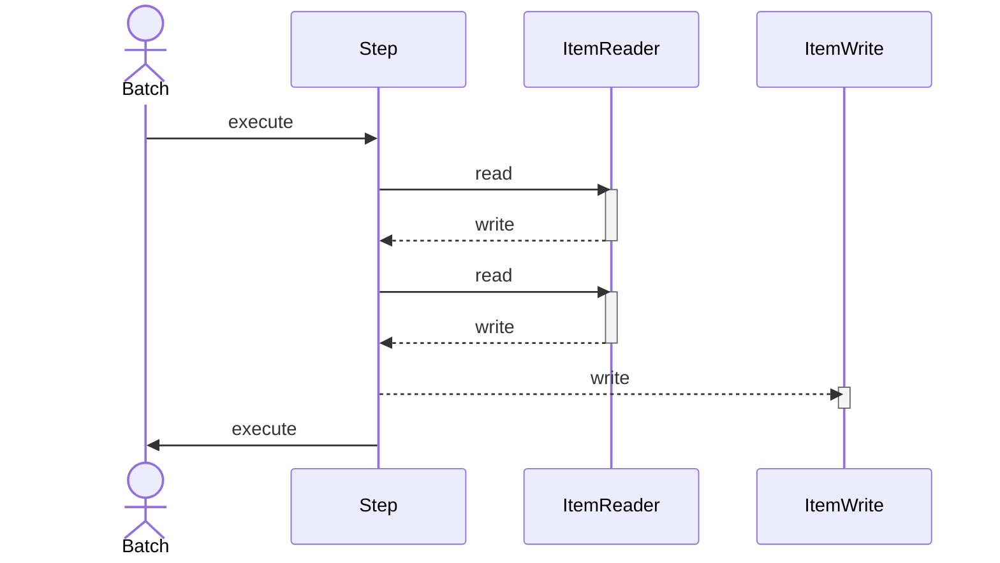
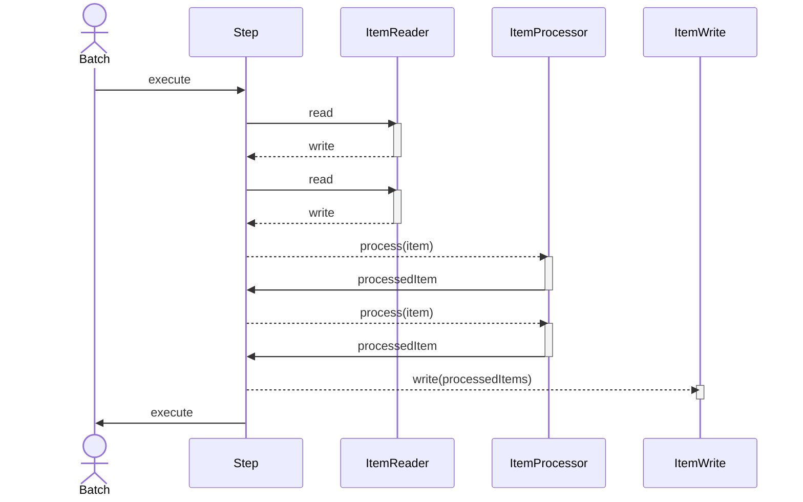

# 스프링 배치 공부

# JobLauncher

#### SimpleJobLauncher

`JobLauncher` 인터페이스의 간단한 구현을 담당하는 클래스이다. 기본 설정에는 동기 작업 실행기(synchronous task executor)를 사용한다. 이 Launcher에는 `JobRepository` 라는 필수 종속성이 하나만 있다. `JobRepository`는 유효한 `JobExecution` 을 얻는 데 사용된다.

## Step 구성

### Chunk 중심 처리



청크 중심 처리는 한 번에 하나씩 데이터를 읽고 트랜잭션 경계내 기록되는 청크를 생성하는 것을 의미한다. 읽은 항목 수가 커밋 간격과 동일하면 `ItemWriter` 에 의해 전체 청크가 기록되고 트랜잭션이 커밋된다.

다음 코드는 동일한 개념을 단순화한 형태를 보여준다.

```java
List items = new ArrayList();
for(int i = 0; i < commitInterval; i++) {
  Object item = itemReader.read();
  if (item != null) {
    items.add(item)
  }
}
itemWriter.write(itmes);
```

또한 `ItemWriter` 에 항목을 전달하기 전에 항목을 처리하도록 선택적 `ItemProcessor`를 사용하여 청크 지향 단계를 구성할 수 있다.



```java
List items = new ArrayList();
for(int i = 0; i < commitInterval; i++) {
  Object item = itemReader.read();
  if (item != null) {
    items.add(item);
  }
}

List processedItems = new ArrayList();
for(Object item: items) {
  Object processedItem = itemProcessor.process(item);
  if (processedItem != null) {
    processedItems.add(processedItem);
  }
}

itemWriter.write(processedItems);
```

### PagaingItemReader에 관하여

`PagingReader` 의 경우 한 번 읽을 때 가져오는 데이터 양인 `fetch size` 를 세팅하는 옵션이 있다. 예를들어 chunk size와 reader fetch size를 10으로 설정할 때 한 번 10개의 Read 후 10개의 write 작업을 반복하게 된다. 즉 1번부터 10번까지 데이터를 가져오고, 다음 11번부터 20번까지 한 번 가져오는 식으로 동작한다.

#### [문제점] 조건을 건 update & delete write 시 Paging Reader 데이터 누락 현상

문제 발생 플로우

1. 처음에 Reader에서 10개 데이터 조회 후 writer로 넘겨서 update or delete 작업을 수행
2. 페이지 하나 증가해야 하니, 두 번째 Reader가 10개를 건너뛰고 10개를 조회한 후 write로 작업을 넘겨줌
3. 2번의 단계에서 변경 및 지워야 할 10개를 건너뜀
    1. 왜냐하면 다음 조회 시 변경 및 삭제한 데이터가 없어졌기 때문에 처음부터 읽어야 함
4. 계속 프로세스가 진행이 되면 Reader에서 처리해야 할 데이터가 맞아 떨어지지 않음

이는 한 번 읽기를 진행하고 나면 page++를 하고 쿼리 실행 시 getPage()를 하는 문제로 인해 발생한다.

#### [해결책] chunk 사이즈를 크게 잡는다.

이 방법은 일괄로 모아서 한 방에 처리하는 방법이다. 하지만 데이터가 큰 경우 WAS의 힙 메모리를 많이 차지하게 되고, DB로 한 번에 넘길 시 갑작스런 DB 부하도 발생할 수 있다.

#### [해결책] page 사이즈를 항상 0으로 설정하도록 오버라이딩한다.

항상 읽을 때 맨 앞 chunk만 바라보게 설정한다. 이 방법은 한 번 transaction 이후 변경이나 데이터를 지우고 나서도 맨 앞을 바라보게 되니 누락될 일이 없다.

#### [해결책] CursorReader를 통해 읽는다.

CursorReader는 Driver와 DB 둘 다 지원해야 사용할 수 있다. 대표적으로 `JdbcCursorItemReader` 가 있는데, 커넥션을 계속 이어둔 상태로 `streaming` 같이 메모리엔 일정 숫자만큼의 DB로 부터 계속해서 읽어들어 다 처리하면 다음 것을 가져오는 방법이다. 이는 적은 메모리로 누락없이 처리할 수 있는 방식인데, 다만 트랜잭션을 길게 가져와야 하고, `write shark` 로 살펴볼 시 네트워크 통신과 커넥션 타임아웃도 길게 설정해야 한다.

#### [해결책] MyBatis에 #{_skiprows}를 삭제

```mysql
SELECT id,
       lesson_name,
       lesson_time,
       start_dt,
       open_dt,
       complete_open_dt
  FROM lesson
 WHERE open_dt BETWEEN #{startDt} AND #{endDt}
   AND complete_open_dt IS NULL
 LIMIT #{_pagesize} OFFSET #{_skiprows}
```

`#{_skiprows}` 는 조회 쿼리에 읽을 데이터의 OFFSET을 담당하는 문이기에, 이 부분을 제거하면 된다.

## 스프링 배치 성능 개선 방법

| 개선 이전 방법                  | 개선 방법                                                    |
| ------------------------------- | ------------------------------------------------------------ |
| Processor 기반 단일 I/O 처리    | Processor 제거 이후 Writer에서 병렬 처리                     |
| Dirty Checking 기반 단일 Update | 데이터 그룹화 및 In Update 활용으로 Database I/O 최소화      |
| In Update 불가능한 경우         | Execute Batch를 사용하여 여러 작업을 묶어서 DataBase I/O를 최소화 |

## 엔드투엔드 테스트

엔드투엔드 테스트는 배치 작업의 전체 실행을 처음부터 끝까지 정의할 수 있다.

```java
@SpringBatchTest
@SpringJUnitConfig(SkipSampleConfiguration.class)
public class SkipSampleFunctionalTests {
  @Autowired
  private JobLauncherTestUtils jobLauncherTestUtils;
  private JdbcTemplate jdbcTemplate;
  
  @Autowired
  public void setDataSource(DataSource dataSource) {
    this.jdbcTemplate = new JdbcTemplate(dataSource);
  }
  
  @Test
  public void testJob(@Autowired Job job) throws Exception {
    this.jobLauncherTestUtils.setJob(job);
    this.jdbcTemplate.update("delete from CUSTOMER");
    for(int i = 1; i <= 10; i++) {
      this.jdbcTemplate.update("insert into CUSTOMER values(?, 0, ? 100000)",
                              i, "customer" + i)
    }
    
    JobExecution jobExecution = jobLauncherTestUtils.launchJob();
    Assert.assertEquals("COMPLETED", jobExecution.getExitStatus().getExitCode());
  }
}
```

* **JobLauncherTestUtils**: 테스트에서 특정 매개변수를 제공할 수 있는 `launchJob(JobParameters)` 메서드도 제공
    * 다만 JobLauncherTestUtils 빈 설정 필요함


### Test Application 설정 파일

```yaml
spring:
  datasource:
    url: jdbc:h2:mem:testdb
    username: sa
    password:
    driver-class-name: org.h2.Driver
    initialization-mode: always
    schema: classpath:data/schema.sql
    data: classpath:data/insert.sql
  batch:
    initialize-schema: embedded
```

* `initialize-schema`: 메타 테이블 생성 설정
    * always: 스크립트를 항상 실행, RDBMS 설정이 되어 있을 경우 내장 DB보다 우선적으로 실행
    * never: 메타테이블 생성 사용 안함
    * embedded: H2같은 임베디드 DB용(= 테스트 용)

### SpringBatchTest 어노테이션

1. Spring Batch 테스트에 필요한 필수 빈들이 로드
    1. 이는 `JobLauncherTestUtils`, `JobRepositoryTestUtils` 등의 유틸리티 클래스를 사용 가능
2. 테스트를 위한 DataSource를 구성
    1. H2 데이터베이스를 기본적으로 사용하며, 필요에 따라 다른 데이터베이스로 설정 가능
3. 테스트 시에만 사용되는 임시 테이블과 데이터베이스 스키마를 설정
4. 기본적인 Spring Batch의 구성이 활성화


## 실습

### 시나리오

spring 배치로 비공개 된 그룹수업을 특정 기간 조건 안에 만족하는 그룹수업을 일괄 공개 설정한다.


### 참고문헌

- https://docs.spring.io/spring-batch/reference/step/chunk-oriented-processing/configuring.html
- https://www.mockaroo.com/


### 공부 및 실습하면서 시행착오 겪은 것들

- mybatis 사용 시 spring 버전 호환 확인할 것
- `JobLauncherTestUtils` 는 테스트 실행 컨텍스트에서 기본적으로 제공되지 않아 테스트 코드에 직접 `bean` 주입 필요
- `@EnableBatchProcessing` 주석은 Spring Boot 3부터 배치에 대한 Spring Boot 자동 구성이 비활성화 됨
    - 위 주석을 사용 안할 시 Mapped Statements collection does not contain value for 에러 발생
- EL1008E: Property or field 'jobParameters' cannot be found on object of type BeanExpressionContext
    - `@StepScop` or `@JobScope` 를 기입
- 테스트 잡 파라미터가 겹치면 전체 테스트 돌릴 때 테스트가 다른 테스트에 영향을 미치는 이슈가 발생