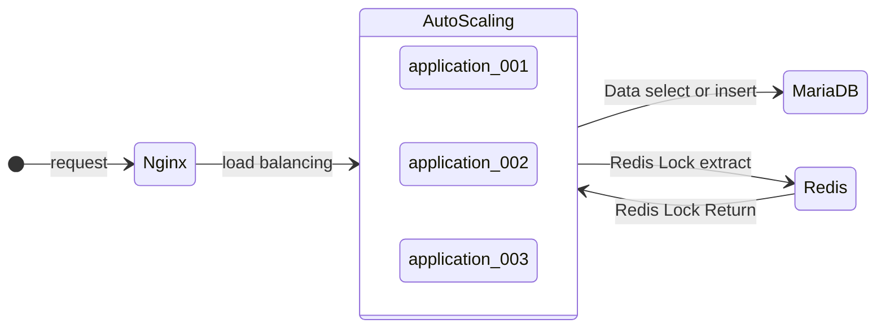
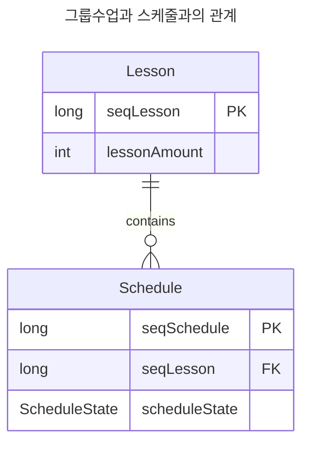
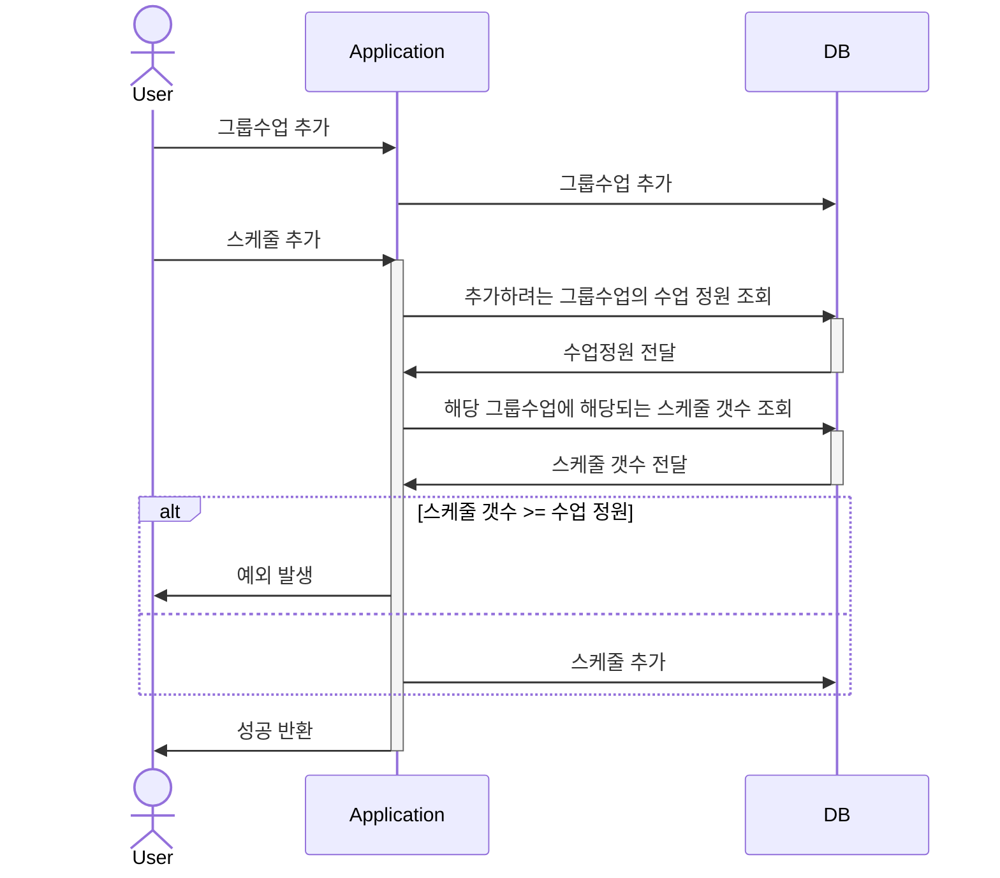

# 분산락

## 문제 원인

그룹수업에 예약 정원이 있다. 즉 정원 만큼 회원의 스케줄 예약을 받겠다는 값인데, 동시성이 발생하게 되면 예약 정원보다 초과하게 되어 센터와 회원과의 분쟁이 발생할 수 있다. 즉 동시성이 발생했기 때문에, 누구의 스케줄을 취소해야 할 지 알 수 없기에 동시성이 발생하지 않도록 조치가 필요해 보였다.

### 기존 처리 방법

기존 처리 방법에는 트랜잭션 고립수준은 READ-UNCOMMITED으로 설정하여 DB 메모리에서 처리중인 스케줄 정보를 확인하여 처리 중인 스케줄 상태와 그룹수업의 스케줄 갯수를 가져와서 유효성을 검증하고 있었다. 즉 WAL 처리 방법으로 redo, undo 파일에 기록되기 전 commit 되지 않고 처리중인 데이터를 조회하는 방법인데, 이 방법은 안전하지 않다. 왜냐하면 데이터를 기록하기 전 스케줄 갯수를 조회할 때 여러 서버에서 동시 다발적으로 조회할 수 있어, 조회 당시에는 문제가 되지 않을 수 있기 때문이다.

따라서 다른 방법이 필요해 보였다.


## 분산락

그래서 SaaS에 퍼져있는 예약 시스템에 접근하기 전 락을 획득하여 동시 다발적으로 예약을 방지해야 될 거 같다. 그래서 락 처리를 하기 전 아래 기본 개념에 해당되는 소제목들을 차근차근 알아보도록 하자.

### 경합상태(race-condition)란?

여러 프로세스가 동시에 공유하는 자원에 접근함에 따라 일어나는 예상치 못한 이상이나 상태를 말한다. 또한 경합 상태를 일으키는 프로그램 코드 부분을 크리티컬 섹션(Critical Section)이라 부르며, 크리티컬 섹션 실행 권한을 얻는 것을 락을 획득한다 말하며, 획득한 권한을 반환하는 것을 락을 해제한다 말한다.

### 분산락이란?

하지만 위 방식에선 한 서버에서 여러 프로세스가 공유 하는 자원에 동시다발적으로 접근 방지하는 방법이긴 하나, 여러 대의 서버에서 실행하는 같은 코드에 대해선 동시다발적으로 접근을 방지할 수 없다. 따라서 여러 서버에서 크리티컬 섹션에 접근하는 것을 방지하기 위한 방법으로 분산락을 도입하기로 했다.

분산락은 분산 시스템에서 안전하게 공유 자원을 사용하고, 동시성을 향상시키기 위한 락이다. 그리고 분산 시스템에서 사용하기 위해선 MariaDB이나 Redis, Zookeeper 같은 외부 툴???를 활용하여 락 처리를 한다.

#### Redis를 선택한 이유

먼저 Zookeeper는 팀에서 해당 기술 스택을 사용중이지 않았다. MariaDB는 분산락을 사용하기 위해 별도의 커넥션 풀을 관리해야 하고, 락에 관련된 부하를 RDS가 받는다는 점, 그리고 Redis가 더 빠르다는 점에서 Redis를 사용하는 것이 더 효율적이라 생각했다.

#### Redisson 라이브러리 사용 이유

Spring boot 2.0 부터 Netty(비동기 이벤트 기반 고성능 네트워크 프레임워크) 기반의 Lettuce가 Redis의 기본 클라이언트로 사용되고 있다. 하지만 Lettuce는 공식적으로 분산락 기능을 제공하지 않아 `setnx`, `setex` 등을 이용해 직접 구현해서 사용해야 한다. Lettuce의 락 획득 방식은 락을 획득하기 위해 레디스에 계속해서 요청을 보내는 스핀락으로 구현되어 있어 레디스에 부하가 생길 수 있다는 특징이 있다.

반면 Redisson은 별도의 Lock interface를 지원한다. 그리고 락 획득 시 스핀락이 아닌 발행/구독(pub/sub) 방식을 사용하는 데, pub/sub 방식은 락이 해제될 때마다 구독중인 클라이언트들에게 락 획득을 시도해도 된다는 알림을 보내게 되어 지속적인 락 획득 요청하는 과정이 사라져 이로인한 레디스의 부하가 발생하지 않는다.

아래는 Redisson과 Lettuce의 차이를 간략하게 정리했다.

* Lock에 타임아웃이 구현되어 있다.

  ```java
  public boolean tryLock(long waitTime, long leaseTime, TimeUnit unit) throws Exception
  ```

* 스핀락을 사용하지 않는다.

    * 따라서 Redis에 부하가 발생하지 않는다.

* Lua 스크립트를 사용한다.

    * 가볍고 빠르며 임베디드 시스템에서 많이 사용되는 스크립트 언어 중 하나


## 실습

### 아키텍처

#### 프로세스



#### ERD



#### 시퀀스 다이어그램




### docker 환경

#### docker-compose 파일

컨테이너란 개별 소프트웨어의 실행에 필요한 실행 환경을 독립적으로 운용할 수 있도록 기반 기술 혹은 다른 실행환경과의 간섭을 막고 실행의 독립성을 확보해주는 운영체제 수준의 격리 수준이다.

```yaml
version: '3.7'

services:
  redis:
    image: redis
    container_name: redis
    hostname: redis
    ports:
      - "6379:6379"
    environment:
      TZ: "Asia/Seoul"
  nginx:
    image: nginx
    container_name: nginx
    restart: on-failure
    volumes:
      - ./config/nginx.conf:/etc/nginx/nginx.conf:ro
    ports:
      - "9999:80"
    depends_on:
      - mariadb
      - redis
  mariadb:
    container_name: mariadb
    image: mariadb:10
    volumes:
      - ./sql:/docker-entrypoint-initdb.d
    environment:
      - MYSQL_DATABASE=database_name
      - MYSQL_USER=demo
      - MYSQL_PASSWORD=1234
      - MYSQL_ROOT_HOST=%
      - MYSQL_ROOT_PASSWORD=root!
    ports:
      - "3306:3306"
  application-demo:
    hostname: application
    restart: on-failure
    environment:
      TZ: "Asia/Seoul"
    build:
      context: .
      dockerfile: Dockerfile
    depends_on:
      - nginx
    deploy:
      replicas: 3
```

* **services**: 컨테이너를 실행하기 위해 정의한다. 컨테이너는 곧 서비스라는 개념으로 접근한다.
* **container_name**: services 내부의 컨테이너 이름을 지정한다.
* **image**: 컨테이너에 사용될 이미지이다.
* **depends_on**: services 간 종속을 설정한다.
* **environment**: 환경 변수를 설정한다.
* **ports**: 호스트와 컨테이너와의 포트를 설정한다.

#### 명령어

테스트를 원활하게 하기 위핸 기존 컨테이너를 모두 삭제하고 새로 컨테이너를 시작하는 방식을 채택했다.

```shell
$ docker-compose up -d --force-recreate
$ docker-compose down --rmi all
```

* **up**: docker compose로 정의된 서비스를 시작한다.
* **-d 또는 --detach**: 백그라운드에서 컨테이너를 실행한다.
* **--force-recreate**: 강제로 이전 컨테이너를 제거하고 컨테이너를 다시 생성한다.
* **down**: Docker Compose로 정의된 서비스를 중지한다.
* **--rmi all**: 모든 사용중인 관련 이미지를 삭제한다.


### 코드 분석

```java
@Target(ElementType.METHOD)
@Retention(RetentionPolicy.RUNTIME)
public @interface DistributedLock {
    /**
     * 락 이름
     */
    String key();

    /**
     * 락 prefix 이름
     */
    String lockPrefix();

    /**
     * 락의 시간 단위
     */
    TimeUnit timeUnit() default TimeUnit.SECONDS;

    /**
     * 락을 기다리는 시간 (default - 5s)
     * 락 획득을 위해 waitTime 까지 기다린다.
     */
    long waitTime() default 5L;

    /**
     * 락 임대시간 (default - 3s)
     * 락을 획득한 이후 leaseTime이 지나면 락을 해제한다.
     */
    long leaseTime() default 3L;
}
```

```java
@Slf4j
@Aspect
@Component
@RequiredArgsConstructor
public class DistributedLockAop {
    private final RedissonClient redissonClient;

    @Around("@annotation(com.example.study.common.task.DistributedLock)")
    public Object lock(final ProceedingJoinPoint joinPoint) throws Throwable {
        MethodSignature methodSignature = (MethodSignature) joinPoint.getSignature();
        Method method = methodSignature.getMethod();
        DistributedLock classScheduleCloseDistributedLock = method.getAnnotation(DistributedLock.class);

        String redisKey = classScheduleCloseDistributedLock.lockPrefix() + CustomSpringELParser.getDynamicValue(methodSignature.getParameterNames(), joinPoint.getArgs(), classScheduleCloseDistributedLock.key());
        RLock redissonClientLock = redissonClient.getLock(redisKey);

        try {
            boolean tryLock = redissonClientLock.tryLock(classScheduleCloseDistributedLock.waitTime(), classScheduleCloseDistributedLock.leaseTime(), classScheduleCloseDistributedLock.timeUnit());
            if (!tryLock) {
                log.info(">>>>>>>>>>>>>> 이미 처리 중인 Lock({}) 입니다.", redisKey);
                return false;
            }

            return joinPoint.proceed();
        } catch(InterruptedException exception) {
            log.info(">>>>>>>>>>>>> Lock 경합 과정에서 에러가 발생했습니다. {}", redisKey, exception);
            throw new InterruptedException(exception.getMessage());
        } finally {
            try {
                redissonClientLock.unlock();
                log.info(">>>>>>>>>>>>> 처리를 완료하여 Lock({})을 해제 했습니다.", redisKey);
            } catch(IllegalMonitorStateException exception) {
                log.debug("Redisson lock already unLock {} {}", method.getName(), redisKey, exception);
            }
        }
    }
}
```

```java
@NoArgsConstructor(access = AccessLevel.PRIVATE)
public class CustomSpringELParser {
    public static Object getDynamicValue(String[] parameterNames, Object[] args, String key) {
        ExpressionParser parser = new SpelExpressionParser();
        StandardEvaluationContext context = new StandardEvaluationContext();

        for(int i = 0; i < parameterNames.length; i++) {
            context.setVariable(parameterNames[i], args[i]);
        }

        return parser.parseExpression(key).getValue(context, Object.class);
    }
}
```

#### SpelExpressionParser

Spring Expression Language 표현식을 파싱하고 평가하는 데 사용된다. 빈 설정, 어노테이션 기반 구성, 빈 정의 등에서 동적으로 동적을 정의하는 데 주로 사용된다.

* **변수**: `#variableName` 형식으로 변수를 참조할 수 있다.
* **속성**: 객체 속성에 접근할 수 있는데, `object.property` 형식으로 속성에 접근할 수 있다.
* **메서드**: 메서드 호출을 객체의 동작을 실행할 수 있다. 예를들어 `object.method()` 형식으로 메서드를 호출할 수 있다.
* **연산자**: 수학 및 논리 연산자를 사용하여 표현식을 작성할 수 있다.
* **타입 변환**: 문자열을 숫자로 변환하거나, 객체를 문자열로 변환할 수 있다.

이외에도 리터럴, 프로젝션 선택등 다양한 기능을 제공한다.

```java
ExpressionParser parser = new SpelExpressionParser();
Expression exp = parser.parseExpression("'Hello World'.concat('!')");
String message = (String) exp.getValue();
```

* message의 값은 'Hello World!' 이다.

#### StandardEvaluationContext

SpEL의 평가 컨텍스트를 나타내며, SpEL 표현식을 평가하고 관리하는 데 사용된다. SpEL 표현식에서 참조할 수 있는 변수 및 함수를 정의하고 표현식을 평가할 때 해당 컨텍스트를 적용할 수 있다.

```java
// 생성자 인수는 firstName, lastName, age 이다.
Member member = new Member("Hello", "World", 30);
ExpressionParser parser = new SpelExpressionParser();
Expression exp = parser.parseExpression("age");
EvaluationContext context = new StandardEvaluationContext(member);

Integer age = (Integer) exp.getValue(context);
```

#### @Around("${pattern}")

지정된 패턴에 해당하는 메서드의 실행되기 전, 실행된 후 모두 동작한다.

#### JoinPoint 인터페이스

호출되는 대상의 객체, 메서드, 전달 파라미터 목록에 접근할 수 있는 메서드를 제공한다.

| 메서드                   | 접근하는 영역               |
| ------------------------ | --------------------------- |
| Signature getSignature() | 호출되는 메서드에 대한 정보 |
| Object getTarget()       | 대상 객체                   |
| Object[] getArgs()       | 파라미터 목록               |

**Signature 메서드 관련 정보**

| 메서드              | 접근하는 영역                                          |
| ------------------- | ------------------------------------------------------ |
| String getName()    | 메서드 이름                                            |
| String toLongName() | 메서드를 완전하게 표현한 문장(반환타입, 파라미터 타입) |
| String getArgs()    | 파라미터 목록                                          |

#### ProceedingJoinPoint

`JoinPoint` 를 상속받은 객체로 `JoinPoint` 와 `Signature` 메서드를 사용할 수 있다. Target Object의 메서드 정보를 포함한다. 또한 `ProceedingJoinPoint.proceed()` 는 타겟 메서드의 실행을 제어할 수 있다.

